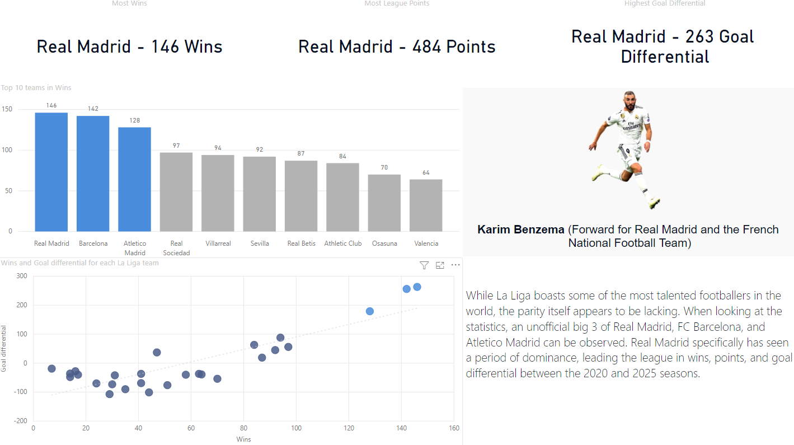
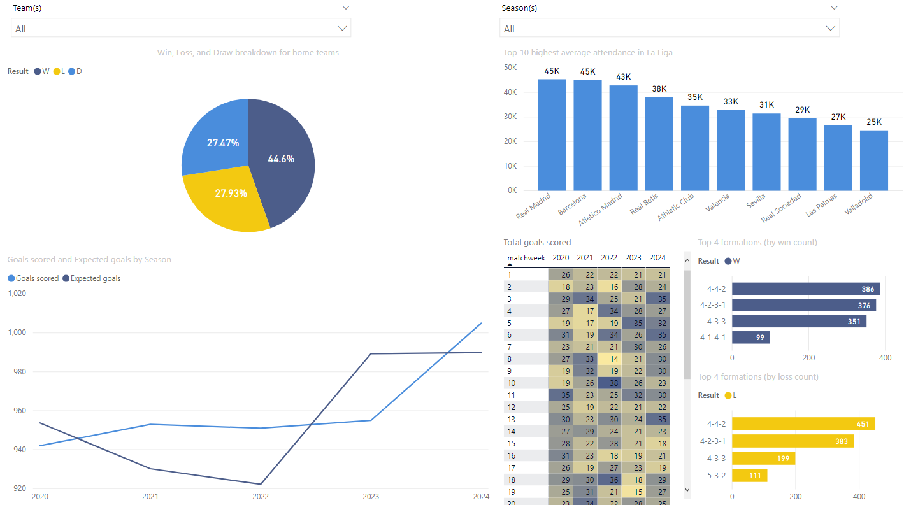
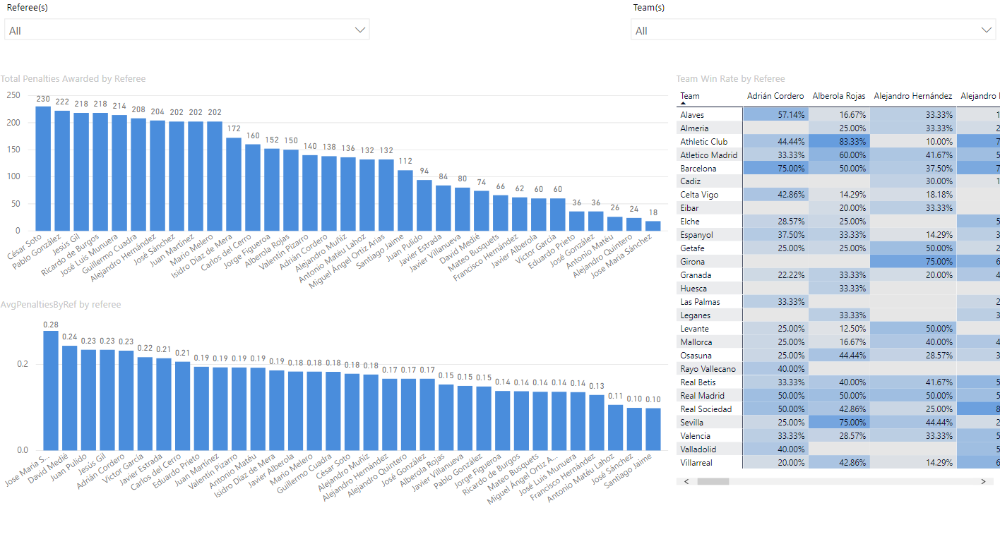
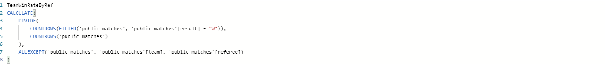
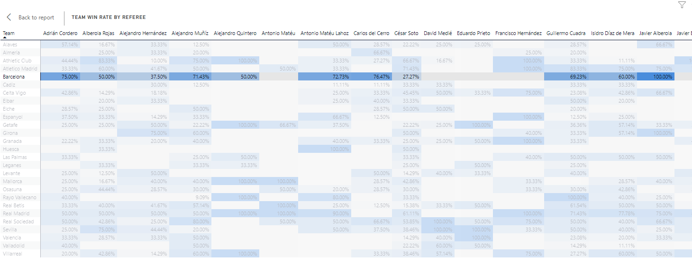
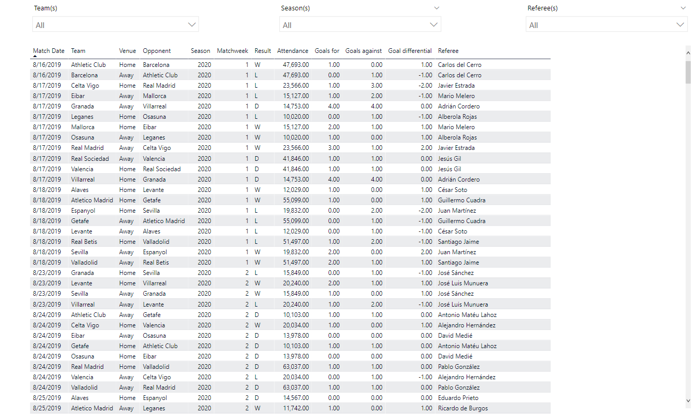

# LaLigaMatchStats
Using a public dataset for La Liga matches, I will explore some basic statistics and visualize it through the use of PowerBI.

Dataset originally downloaded from Kaggle: https://www.kaggle.com/datasets/marcelbiezunski/laliga-matches-dataset-2019-2025-fbref
Tools & Techniques Used:
- Power BI Desktop
- SQL (Supabase PostgreSQL db)
- Data modeling with star schema
- DAX measures for dynamic insights
- Conditional formatting and custom visuals

Key Features:
- League Leaders: Visual breakdown of top teams by wins, losses, goal differential, and points.
- Match Trends & Statistics: Analysis of average goals, home vs away performance, seasonal comparisons, and matchweek scoring patterns.
- Referee Analysis: Investigating potential referee bias using penalty kick data and match outcomes.
- Match Data Explorer: Interactive table with slicers for team, season, and referee — ideal for specific data drilling.

Possible Business Applications: 
This simple dashboard could help La Liga analysts identify referee bias, team dominance trends, and tactical formations associated with match outcomes — useful for scouting, scheduling, or fan engagement strategies.

Screenshots of Report:

Page 1: simple analysis on the relative dominance that the top teams have had over the time period.

Page 2: General match trends and goal statistics. They're broken down by season, venue, and matchweek. Also included are the row charts comparing some of the highest and lowest performing formations in the league (with some formations appearing in both charts, possibly indicating that a team's formation may have less to do with the match outcome in comparison to player talent).

Page 3: General referee analysis based on penalties awarded and average penalties given. There's also a provided matrix for win rate for each team based on the appointed referee. Conditional background formatting has been applied to make it easier for the user to differentiate.

Here's a screenshot of the DAX code needed to compute the average penalties given for the bar chart shown previously.

Here's a closer look at the win rate matrix. Note the highlighting done on the Barcelona row, allowing the user to easily navigate and differentiate between more and less favorable referees.

Page 4: Simple match data explorer with relevant slicers.

